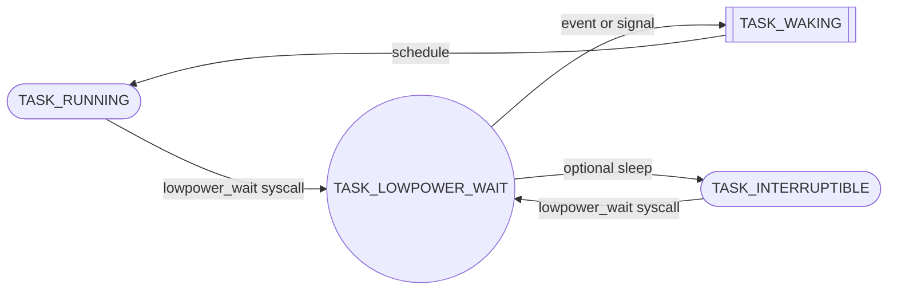
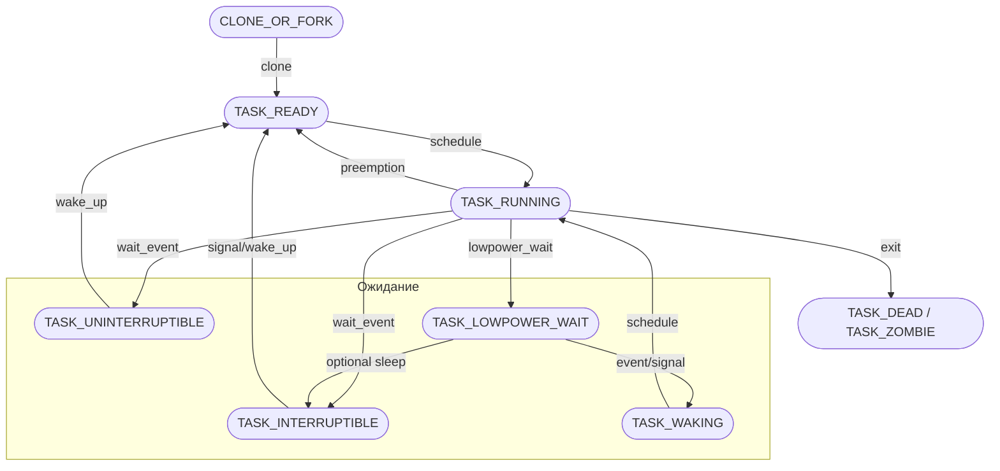

# 4) История и мотивация создания проекта

---

## 4.1 Почему возникла идея

В ходе работы с ядром Linux и изучения внутренностей планировщика (`CFS`) и подсистем энергосбережения возникло несколько наблюдений:

1. **Состояния процесса формируют поведение всей системы.**
   Планировщик, cpuidle, cpufreq, freezer, runtime PM — все эти подсистемы ориентируются на **состояния задач** (`TASK_RUNNING`, `TASK_INTERRUPTIBLE`, `TASK_UNINTERRUPTIBLE` и др.). Любое изменение состояния влияет на загрузку CPU, выбор C/P-состояний, переходы устройств и даже на работу hibernation. \[1]\[2]

2. **Ограниченность текущего автомата.**
   Текущая система состояний хорошо покрывает базовые сценарии, но:

   * Нет состояния, которое явно отражало бы **«ожидание для снижения энергопотребления»**.
   * Нет прямого способа, чтобы планировщик и PM подсистема могли различать короткий сон (например, ожидаем I/O) и сознательное энергосберегающее ожидание.

3. **Охват ядра через scheduler.**
   Планировщик взаимодействует практически со всеми подсистемами ядра:

   * CPU scheduling (CFS, RT)
   * SMP и affinity
   * IRQ и softirq
   * memory management (sleeping tasks → страницы могут быть swapped)
   * PM и freezer
   * kthreads, workqueues и kernel timers

   Таким образом, изменение механизма управления состояниями задач позволяет изучить **широкий спектр структур ядра** без необходимости сразу заниматься глубокими математическими оптимизациями планировщика.

---

## 4.2 Что подтолкнуло к проекту

* **Практический интерес:** понять, как состояние задач влияет на энергопотребление, планирование и работу устройств.
* **Исследовательская ценность:** возможность создать новый конечный автомат, который позволит:

  * отдельно моделировать «активность» и «энергосбережение» процесса,
  * исследовать взаимодействие с PM, freezer, cpuidle, cpufreq.
* **Подготовка к интервью Huawei:** проект затрагивает **состояния процессов, планирование, энергоменеджмент и работу с ядром** — все ключевые темы, которые они заявляют в вакансии.

---

## 4.3 Цели исследования

1. **Изучить текущий механизм состояний**: как ядро управляет переходами, какие флаги и вспомогательные состояния существуют.
2. **Понять влияние состояния на PM**: cpuidle, cpufreq, runtime PM, freezer, system suspend.
3. **Создать новый экспериментальный автомат**: добавить состояние `TASK_LOWPOWER_WAIT` или аналогичное, чтобы процесс мог сигнализировать ядру о готовности к энергосбережению.
4. **Протестировать и визуализировать взаимодействие** с планировщиком и PM: через коды задач, профилирование PELT, iowait, idle, wakelocks.
5. **Получить глубокий охват ядра**: память, scheduler, I/O, CPU, PM, concurrency.

---

# 5.1 Основная идея проекта

---

Основная идея проекта заключается в том, чтобы **создать экспериментальный механизм управления состояниями процессов в Linux**, который позволит ядру и планировщику учитывать задачи, готовые к энергосбережению, **без изменения логики выполнения критичных операций**.

Цель — не повысить производительность, а **максимально изучить внутренние взаимодействия ядра**, планировщика и подсистем энергоменеджмента. Проект фокусируется на том, как процесс может сигнализировать о своей готовности **временно уменьшить активность**, позволяя CPU и периферии переходить в энергосберегающие режимы, при этом оставаясь корректным с точки зрения ядра.

Ключевые аспекты идеи:

1. **Состояния задач как центральный элемент управления системой**

   * Каждое состояние процесса в Linux влияет на планировщик (`CFS`, RT), PM (`cpuidle`, `cpufreq`, runtime PM) и freezer.
   * Текущие состояния (`RUNNING`, `SLEEPING`, `UNINTERRUPTIBLE`, `ZOMBIE`) покрывают базовые сценарии, но не отражают намерение задачи **способствовать энергосбережению**.

2. **Введение нового состояния `TASK_LOWPOWER_WAIT`**

   * Это состояние будет сигнализировать ядру: «Я готов снизить свою активность и не мешать энергосбережению».
   * В отличие от обычного сна (`TASK_INTERRUPTIBLE`), задача не блокирует важные подсистемы, но остаётся корректной с точки зрения планировщика и PM.

3. **Изучение ядра через эксперимент**

   * Планировщик и PM подсистема видят это состояние и реагируют на него.
   * Проект позволит исследовать: взаимодействие с runqueue, PELT/util\_avg, cpuidle, cpufreq, freezer и runtime PM.
   * Такой экспериментальный подход даёт широкий охват структуры ядра, позволяя безопасно тестировать идеи по энергосбережению без глубоких оптимизаций алгоритмов.

4. **Образовательный и исследовательский эффект**

   * Проект создаёт платформу для визуализации и анализа состояний задач и их влияния на энергопотребление.
   * Позволяет понять внутренние механизмы планировщика, профилирования, работы I/O, concurrency и взаимодействия с различными подсистемами ядра.

---

## 5.2 Мотивация создания

В Linux текущий набор состояний (`TASK_RUNNING`, `TASK_INTERRUPTIBLE`, `TASK_UNINTERRUPTIBLE`, `TASK_STOPPED`, `TASK_TRACED`, `TASK_ZOMBIE`, `TASK_DEAD`) позволяет ядру корректно управлять планировкой и ожиданием событий. Однако есть несколько ограничений:

1. **Нет явного состояния для энергосбережения**

   * `TASK_INTERRUPTIBLE` и `TASK_UNINTERRUPTIBLE` сигнализируют о том, что процесс ожидает события, но ядро не различает: «процесс активен, ждёт I/O» и «процесс сознательно готов к минимальной активности для экономии энергии».
   * В текущей модели, даже если все процессы «спят», планировщик и cpuidle ориентируются только на util\_avg и наличие runnable задач, не имея информации о намерениях задач по снижению энергопотребления.

2. **Нет гибкости для исследования взаимодействия с PM**

   * Добавление нового состояния даст возможность экспериментировать с scheduler, cpuidle, cpufreq, freezer и runtime PM, наблюдая прямое влияние состояния процесса на энергопотребление.
   * Это позволит безопасно тестировать новые политики управления энергией без изменения самой логики выполнения процессов.

---

## 5.3 Противопоставление текущим состояниям

| Состояние              | Основное назначение                | Ограничения                                             | Отличие `TASK_LOWPOWER_WAIT`                                             |
| ---------------------- | ---------------------------------- | ------------------------------------------------------- | ------------------------------------------------------------------------ |
| `TASK_RUNNING`         | Готовность к исполнению            | Использует CPU, мешает C-state/idle                     | N/A                                                                      |
| `TASK_INTERRUPTIBLE`   | Сон, возможен пробуждение сигналом | Влияет на load avg, может мешать runtime PM             | Явно указывает на готовность к энергосбережению                          |
| `TASK_UNINTERRUPTIBLE` | Сон без пробуждения сигналом       | Может блокировать планировщик, мешает метрикам нагрузки | `LOWPOWER_WAIT` не блокирует критичные подсистемы                        |
| `TASK_STOPPED/TRACED`  | Остановка/отладка                  | Задачи не планируются, но могут удерживать ресурсы      | `LOWPOWER_WAIT` фокусируется на энергосбережении, не на контроле/отладке |
| `TASK_ZOMBIE/DEAD`     | Завершение                         | Ресурсы очищены                                         | N/A                                                                      |

**Ключевая идея:** `TASK_LOWPOWER_WAIT` — это состояние, в котором процесс **готов к энергосбережению**, но при этом остаётся корректным участником ядра, не блокируя критичные подсистемы.

---

## 5.4 Переходы состояний

### Основные сценарии:

1. **Вход в `TASK_LOWPOWER_WAIT`:**

   * Из **`TASK_RUNNING`** или **`TASK_INTERRUPTIBLE`**, когда процесс сознательно хочет снизить активность.
   * Процесс вызывает специальную системную функцию/интерфейс (`syscall` или kernel API) для постановки в `LOWPOWER_WAIT`.

2. **Выход из `TASK_LOWPOWER_WAIT`:**

   * **`TASK_RUNNING`**: при событии, требующем исполнения (I/O завершено, сигнал, таймер).
   * **`TASK_INTERRUPTIBLE`**: если нужно вернуться к обычному блочному ожиданию событий.

### Промежуточные состояния:

* `TASK_WAKING`: как и в обычном переходе сна → runnable, промежуточное состояние защищает SMP от гонок.
* `TASK_PARKED` или `TASK_IDLE`: в случае использования низкоуровневого idle для kthreads, когда `LOWPOWER_WAIT` может рассматриваться как «условно спящая задача».

**Схема переходов:**

---

## 5.5 Влияние на планировщик и подсистемы PM

1. **Scheduler (CFS/RT):**

   * `TASK_LOWPOWER_WAIT` учитывается при расчёте `util_avg`, но с меньшим весом, позволяя CPU уходить в idle.
   * Влияние на EAS: можно задать кластеры, где такие задачи могут «ожидать» без блокировки быстрых CPU.

2. **CPU Idle / C-states:**

   * Процесс в `LOWPOWER_WAIT` не препятствует переходу в глубокие C-states.

3. **CPU Frequency / P-states:**

   * `schedutil` и `PELT` учитывают снижение активности, позволяя governor’у снижать частоту и напряжение без риска падения производительности критичных задач.

4. **Freezer / System Suspend:**

   * Процесс можно считать «безопасным» для freeze, не требуется принудительно переводить в `TASK_FROZEN`.
   * Улучшается прогноз времени сна, уменьшает необходимость wakelocks.

5. **Runtime PM устройств:**

   * Устройства могут уходить в autosuspend, пока процесс находится в `LOWPOWER_WAIT`.

---

## 5.6 Дальнейшие перспективы

* **Эксперименты с энергопотреблением:** можно исследовать влияние «умного сна» задач на энергопотребление CPU и устройств.
* **Оптимизация scheduler:** возможность создавать эвристики, где задачи сознательно ожидают перехода в low-power режим, что особенно важно для гетерогенных систем (big.LITTLE).
* **Расширение исследований PM:** мониторинг wakeup-событий, runtime PM, iowait и idle в новом контексте.
* **Моделирование гибридных состояний:** совмещение обычного сна с энергосбережением, создание «адаптивных» состояний для будущих исследований по OS kernel optimization.

---

## 5.7 Схема

### Описание новых переходов

1. RUN → LPW

  * Процесс добровольно переходит в low-power ожидание через syscall/интерфейс.

2. LPW → WAKING

  * Срабатывает событие или сигнал, задача готова вернуться к выполнению.

3. LPW → INT

  * Опциональный переход: если задача решает перейти в обычный прерываемый сон.

4. WAKING → RUN

  * Планировщик ставит задачу обратно в runnable.

Старые переходы сохраняются, чтобы не нарушать существующую логику CFS/RT.